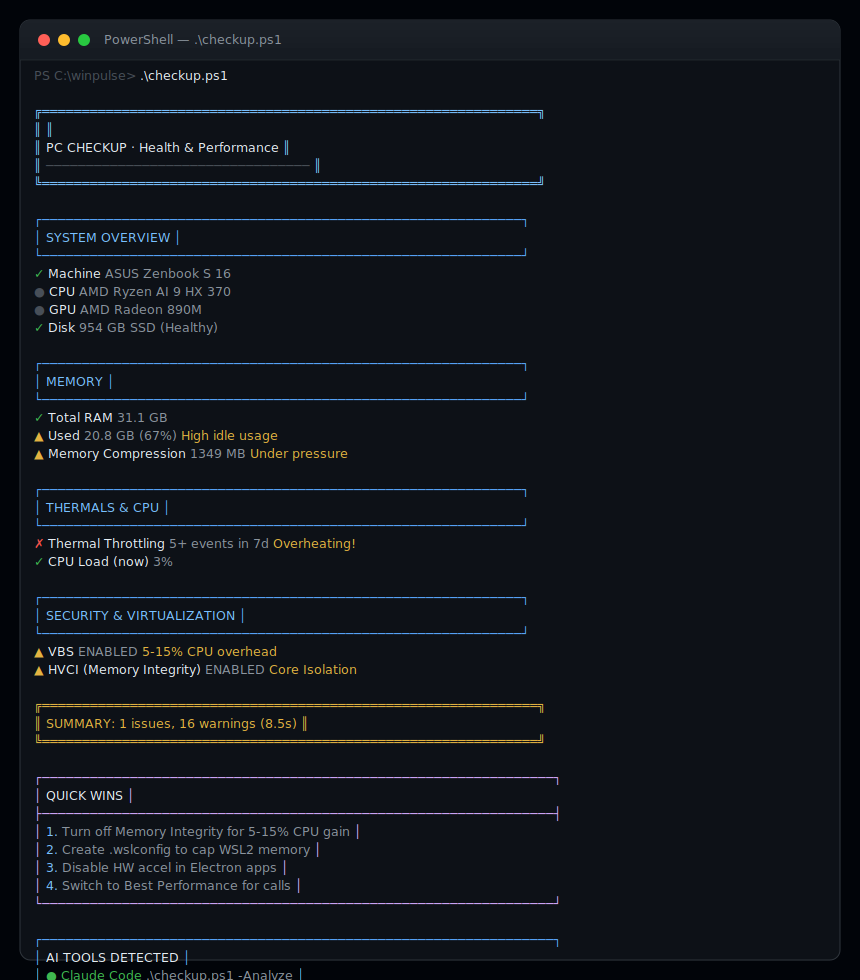

# WinPulse

**One-command Windows health check with AI-powered analysis.**

Scans your Windows notebook for 15 categories of performance issues (thermals, memory pressure, security overhead, startup bloat, and more), then pipes the results to any AI for instant, personalized optimization advice. Works with Claude, ChatGPT, Codex, Ollama, or any AI CLI you have installed.

> Zero install. Single file. Read-only (never changes your settings). AI-ready output.


## Preview

<p align="center">
  
</p>

## What it checks

| Category | Details |
|----------|---------|
| System | CPU, RAM, GPU, disk type, BIOS version, display resolution, uptime |
| Memory | Usage breakdown, top consumers, memory compression, pagefile |
| Battery | Charge, health % vs design capacity (Wh) |
| Thermals | CPU temperature, thermal throttling events (7 day history) |
| Disk | SSD/HDD health, volume usage per drive, temperature |
| Power | Active power plan, CPU min/max state, throttling detection |
| Security | VBS/HVCI overhead, Hyper-V, System Guard |
| Defender | Real-time protection, scan CPU limit, exclusion paths, signature age |
| WSL/Docker | vmmem RAM usage, .wslconfig validation |
| Startup | All auto-start programs, flags heavy Electron apps |
| Bloat | Widgets, Phone Link, Edge WebView2, Xbox Game Bar, Cortana |
| Network | Adapter speed, WiFi power save, DNS provider |
| Updates | Last update date, pending reboot detection |
| Stability | App crashes (7 days), blue screens (30 days) from Event Log |
| Drivers | GPU driver version and age |

## Quick start

```powershell
# Clone and run
git clone https://github.com/Samuell1/winpulse.git
cd winpulse
.\checkup.ps1
```

Or download just the script:

```powershell
# One-liner (no install needed)
irm https://raw.githubusercontent.com/Samuell1/winpulse/main/checkup.ps1 -OutFile checkup.ps1; .\checkup.ps1
```

Or double click `checkup.cmd`.

## AI integration

WinPulse is built AI-first. Every scan generates a structured, prompt-engineered report designed for LLM consumption. The AI receives your full system state and returns a prioritized action plan.

```
┌──────────┐     ┌───────────────┐     ┌──────────────┐     ┌──────────────────┐
│  Scan PC │ ──▶ │ Build Report  │ ──▶ │ Detect AI    │ ──▶ │ Get Analysis    │
│  (8-10s) │     │ (15 sections) │     │ (auto/manual)│     │ (personalized)  │
└──────────┘     └───────────────┘     └──────────────┘     └──────────────────┘
```

The report includes a system prompt that instructs the AI to:
1. Give a health score (1-10) with a one-line verdict
2. Rank the top 3 most impactful fixes by performance gain
3. Provide exact steps for each fix
4. Identify what's fine and can be ignored
5. Generate a "before your next video call" checklist

### Supported AI tools

| Tool | Command | How it's used |
|------|---------|---------------|
| [Claude Code](https://docs.anthropic.com/en/docs/claude-code) | `claude` | `claude -p "<report>"` |
| [OpenAI Codex](https://openai.com/index/codex/) | `codex` | `codex -q "<report>"` |
| [Ollama](https://ollama.com) | `ollama` | `echo "<report>" \| ollama run <model>` |
| [aichat](https://github.com/sigoden/aichat) | `aichat` | `echo "<report>" \| aichat` |
| [Mods](https://github.com/charmbracelet/mods) | `mods` | `echo "<report>" \| mods` |
| [LLM](https://github.com/simonw/llm) | `llm` | `echo "<report>" \| llm` |
| [ShellGPT](https://github.com/TheR1D/shell_gpt) | `sgpt` | `echo "<report>" \| sgpt` |
| [Fabric](https://github.com/danielmiessler/fabric) | `fabric` | `echo "<report>" \| fabric` |

### Usage

```powershell
# Auto-detect best AI and analyze
.\checkup.ps1 -Analyze

# Use a specific AI
.\checkup.ps1 -Analyze -Ai ollama -Model llama3

# Use Claude Code specifically
.\checkup.ps1 -Analyze -Ai claude

# Copy to clipboard (paste into ChatGPT, Claude web, etc.)
.\checkup.ps1 -Clipboard

# Output plain text (pipe to anything)
.\checkup.ps1 -Report | claude -p "analyze this PC report"

# Save to file
.\checkup.ps1 -Save report.txt
```

The `-Report` and `-Clipboard` modes include a pre-written system prompt that tells the AI to act as a Windows performance expert and give structured, actionable advice.

## All flags

| Flag | Description |
|------|-------------|
| (none) | Fancy colored terminal output with summary |
| `-Report` | Plain-text report to stdout (no colors). Pipe to anything |
| `-Clipboard` | Copy plain-text report to clipboard for pasting into web AI |
| `-Analyze` | Auto-detect local AI CLI and get instant analysis |
| `-Ai <name>` | Force a specific AI tool (e.g. `-Ai ollama`) |
| `-Model <name>` | Model override for AI tools that support it (e.g. `-Model llama3`) |
| `-Save <path>` | Save plain-text report to a file |

## Running as administrator

Some checks benefit from admin privileges:

- CPU temperature readings
- Full Defender exclusion paths
- Detailed thermal zone data

```powershell
# Run as admin
Start-Process powershell -Verb RunAs -ArgumentList "-File $PWD\checkup.ps1"
```

## Requirements

- Windows 10 or 11
- PowerShell 5.1+ (built into Windows)
- No dependencies, no install, no modules

## License

MIT
